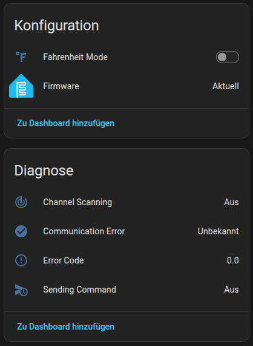
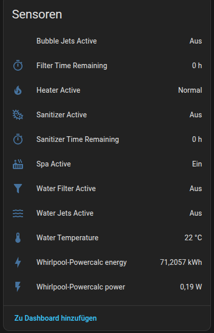
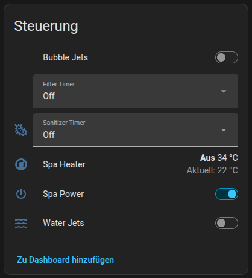
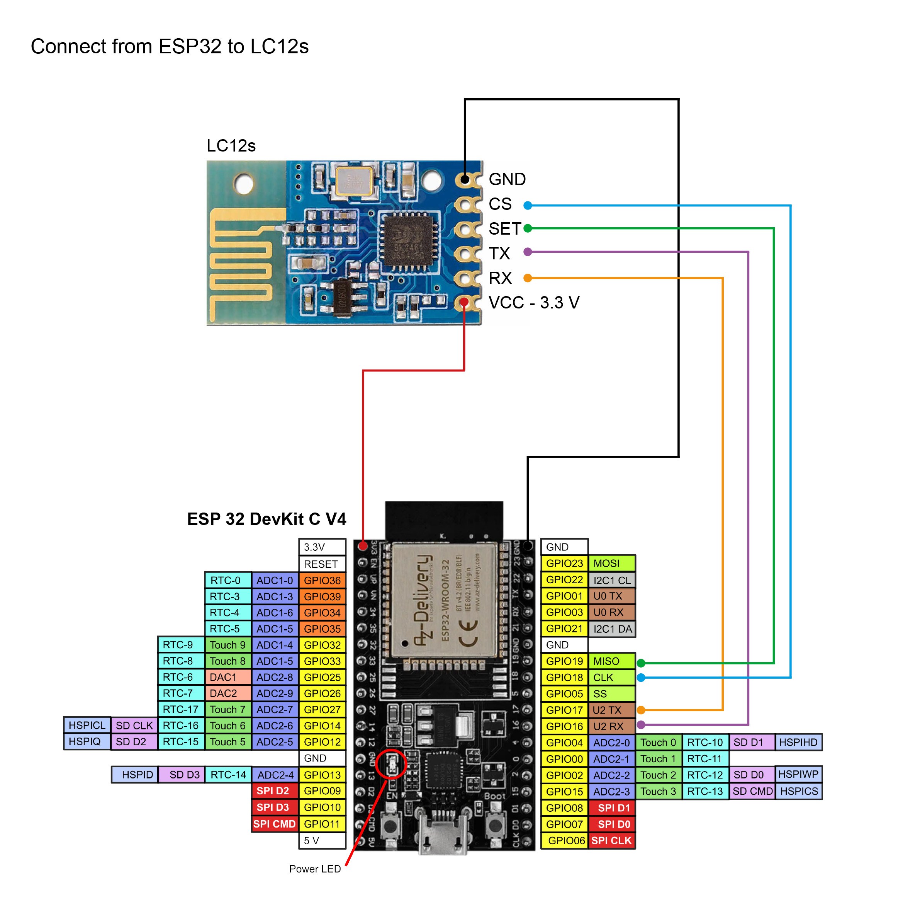

# Intex® PureSpa remote control for Home Automation

**Control your PureSpa with a simple ESPHome device** for Non-WiFi, wireless controlled Spas.
No Hardware-Mod on Spa-side necessary!

  

## Credits & AI-Disclosure
Thanks to the awesome work of [Yogui79](https://github.com/Yogui79/IntexPureSpa) I was able to create this ESPHome component.
As I know virtually nothing about python ort esphome, this was created with heavy AI-Support. Like it or not: Nobody forces you to use it.

## Hardware
You need an ESP32 DevKit V4 Board (others are not tested, according to Yogui79 V1 are not working), like [this one](https://www.amazon.de/dp/B0DJ2ZCZT7).
You also neet an LC12s tranceiver like [that one](https://www.amazon.de/5PCS-LC12S-UART-Serial-Module/dp/B0CSCNS53J) - make sure it is actually LC12s! There is a similar board that will not work.

### Pinout

Connect the LC12s as follows:

| LC12S | ESP32 | Arduino |
|-------|-------|---------|
| GND   | GND   | GND     |
| CS    | D18   | D5      |
| SET   | D19   | D6      |
| TX    | D16   | D2      |
| RX    | D17   | D4      |
| VCC   | 3.3V  | 3.3V    |



## Preparation
You need to find out your individual ChannelID and NrtworkID. See and use [Yogui79's tools](https://github.com/Yogui79/IntexPureSpa/tree/main#channel-and-network-id-detection) for that.

## Setup
In ESPHome Builder, create a configuration for the new board.
There is an example attached but most impprtantly you will need the following blocks:

```yaml
# Add the Intex Spa component from fsedarkalex' repo
external_components:
  - source: github://fsedarkalex/ESPHome-IntexSpa-Component
    components: [ intex_spa ]
```

```yaml
# The LC12s interface
uart:
  id: lc12s
  tx_pin: GPIO17
  rx_pin: GPIO16
  baud_rate: 9600
  rx_buffer_size: 256
```

```yaml
# The actual spa component
intex_spa:
  id: my_spa
  uart_id: lc12s
  network_id: 0x1A2B    # <-- Enter yopur network ID
  channel:    0x2A      # <-- Enter your Channel
  model:      28458     # 28458 (with Waterjet+Sanitizer) OR 28442 if no sanitizer and jet
  cs_pin:     18        # LC12S CS  (default GPIO18)
  set_pin:    19        # LC12S SET (default GPIO19)
  active_scan: true     # true = send life signal during scan (faster); false = passive listen only (slow)
```
